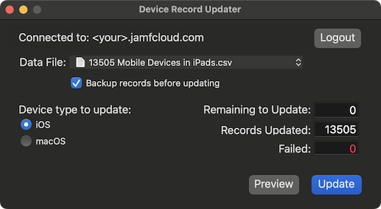
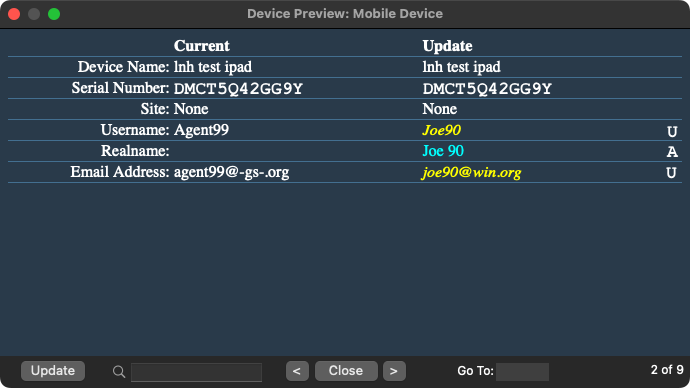

# Device Record Updater (dru)
Perform mass updates to multiple attributes on either iOS or macOS device records stored on your Jamf Pro server.<br>
Download: [dru](https://github.com/BIG-RAT/dru/releases/latest/download/dru.zip)<br>



Provides the option to back-up a device record before updating it.  Note this is not a full back-up of all the device attributes but rather attributes we can change; name, asset tag, site, location attributes...  Backups are stored in:<br>
&nbsp;&nbsp;&nbsp;&nbsp;&nbsp;&nbsp;&nbsp;&nbsp;```~/Library/Application\ Support/dru/backups``` <br>
and can be dropped back into the app to restore values.<br>
The backup folder can quickly be accessed from either tne menu bar (View --> Backups) or by using command + B.

Preview potential changes on individual records before committing them.  You can go to a particular device by either entering a serial number in the find field or entering a record number (line number of the device from the imported data) in the Go To field.<br>
<br>
Changes can be identified by either the color of the text in the Update column or the character at the far left of the atttibute being changed:
<br>
<div style="margin-left: 55px;">
    <table>
      <tr>
        <td>adding a value</td>
        <td>aqua</td>
        <td>A</td>
      </tr>
      <tr>
        <td>updating a value</td>
        <td>yellow</th>
          <td>U</th>
      </tr>
      <tr>
        <td>deleting a value</td>
        <td>red</th>
          <td>D</th>
      </tr>
    </table></div><br>

The Update button allows you to update the record currently being viewed.<br>

To remove the value of an attribute enter a space as the value, leaving the value blank will leave the attribute value unchanged.<br>
Note: only attributes that have a value or have a value being set are displayed.  Sites are an exception to this rule.<br>

A header row is required in the data file.  A template can be created from the file menu:


The application will look for known headers; computer name, display name, serial number, serial_number, udid, asset tag, asset_tag, full name, username, email address, email_address, building, department,position, room, phone number, user phone number, device phone number, phone, site.  Other headers will be classified as extensions attributes.  As a result you cannot have an extension attributed titled the same as a know header.  For example you can't have an extension attribute called site as it is defined as a known header (taken by a built in attribute), or 'computer name' as it is associated with the built in attribute 'name' from a computer record.  Note, using these known headers allows one to export an advanced search to create a data file.
Currently updates are based on serial number, that being the only required data field (column).

Log information can be accessed from the menu bar (View --> Logs) or by pressing command + L.

## History

2022-12-31: v0.9.0 -  Layout change.  Update to support bearer token.  Various updates and fixed.

